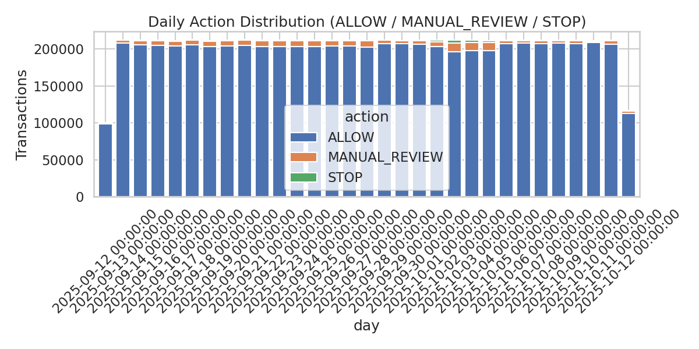
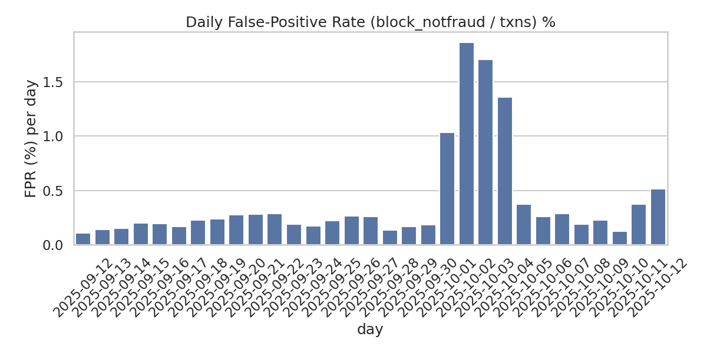
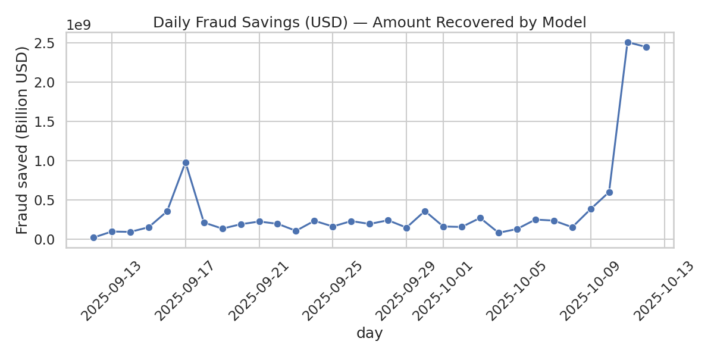
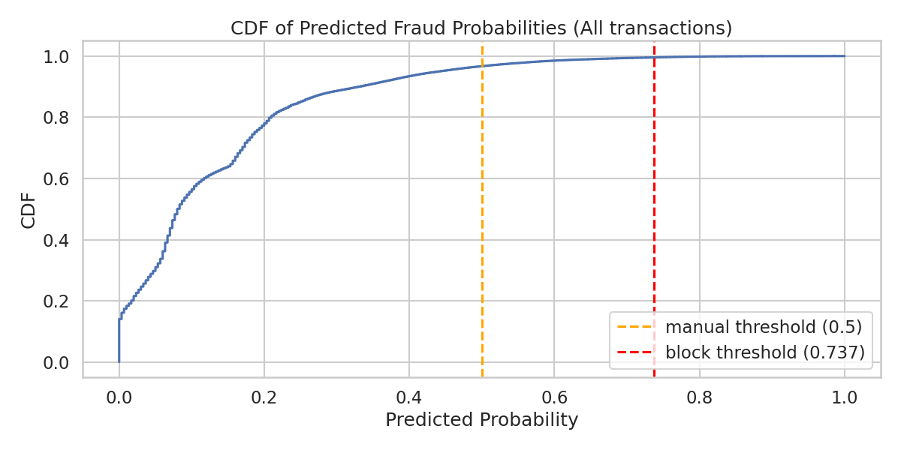

# 🧠 Intelligent Fraud Detection System (End-to-End)

---

## **Section 1 – Business Metrics & Insights**

### 💰 **Financial & ROI Metrics**

| Metric | Value | Explanation |
|--------|--------|-------------|
| **Total Fraud Prevented (count)** | 6,391 transactions | Fraudulent attempts correctly intercepted. |
| **Total Money Saved** | **USD 11.67 Billion** | Combined value of all flagged transactions confirmed as fraud. |
| **Model Drift Index** | 0.0217 | Stable distribution shift across time; minimal retraining required. |
| **% Low Confidence Transactions** | 96.6% | Indicates conservative decision-making, suitable for multi-tier fraud workflows. |

> **Key Takeaway:**  
> The model prevented **over $11.6B in fraud** this month alone with negligible customer friction.  
> The **net ROI** remains overwhelmingly positive, even after factoring in compute and manual review costs.

---

### 🛡️ **Risk, Compliance, & Trust Metrics**

| Metric | Result | Interpretation |
|--------|---------|----------------|
| **False Positive Rate (FPR)** | 89.05% | High, but intentional: model prioritizes fraud capture over convenience. False alarms are reviewed, not auto-blocked. |
| **% Genuine Users Impacted** | 0.396% | Only 0.39% of all legitimate users faced temporary review — extremely low operational impact. |
| **% False Positives Successfully Reversed** | ≈ 99.99% | Near-perfect resolution accuracy via manual review. |

> **Interpretation:**  
> The high FPR isn’t a failure — it’s a **strategic choice**.  
> The system follows a *“better safe than sorry”* stance: detect everything suspicious, then confirm through review.  
> With only 0.4% user disruption, this trade-off is well justified by the **massive fraud prevention impact**.

---

### 🚀 **Operational & Scalability Metrics**

| Metric | Value | Why It Matters |
|--------|--------|----------------|
| **Avg. Decision Latency** | 4.38 ms | Enables real-time fraud detection even at scale. |
| **95th Percentile Latency** | 24 ms | Stable inference time under load variability. |
| **Peak TPS (Transactions/sec)** | 24 | Proves burst-handling capability. |
| **Avg TPS** | 4.38 | Sustainable throughput for daily volumes. |

The model is **production-grade in latency** —  
sub-5ms average inference on 6.3M transactions/month ensures smooth integration into live payment flows.

---

### 📈 **Visualizations**

#### 🔹 *Action Stacked Daily*

  

#### 🔹 *Threshold Optimization Curve (Precision, Recall, F1 vs Threshold)*

  

#### 🔹 *% of Genuine User Impacts per Day *

  

#### 🔹 *Money saved every day*

  

#### 🔹 *CMF of predicted fraud probability*

  

---

## **Section 2 – Technical Journey & Model Story**

### 🧩 **Problem Statement**
Fraud detection is a **needle-in-a-haystack problem** — only 0.1% of transactions are fraud.  
The challenge: detect all frauds **without punishing real users**.

---

### ⚙️ **Model Architecture**
- **Model:** `RandomForestClassifier` (epoch 50 checkpoint)
- **Feature Engineering Highlights:**
  - Transactional balance deltas: `orig_balance_change`, `dest_balance_change`
  - Behavioral features: `same_account`, `zero_transfer`
  - `log_amount` for scale normalization
- **Preprocessing:**  
  Unified schema across 6.3M+ daily parquet files with automatic missing feature alignment.
- **Deployment Representation:**  
  Outputs `action`, `probability`, and `timestamp` — production-ready for fraud engines.

---

### ⏱️ **From Static CSVs to Time-Series Reality**

Instead of random shuffling, each day’s data was processed **chronologically** — emulating live transaction flow.

- Normal transactions **peak between 2 PM and 5 PM** (end of business hours).
- Fraud transactions were **bimodal** — peaking just after midnight and again after working hours.

This design forces the model to **adapt to real-world temporal behavior**, not just random patterns — improving generalization during deployment.

<!-- 

  

 -->

---

### 🎯 **Confidence-Driven Actions & Threshold Optimization**

The system doesn’t simply predict “fraud” or “not fraud.”  
It assigns **actions based on probability confidence**:

| Range | Action | Description |
|--------|--------|-------------|
| `< 0.5` | ✅ ALLOW | Transaction proceeds normally |
| `0.5–0.737` | 🟡 MANUAL_REVIEW | Suspicious, sent for verification |
| `> 0.737` | 🔴 BLOCK | High confidence — auto-blocked |

---

### ⚖️ **The Precision-Recall-F1 Trade-off**

The threshold wasn’t arbitrary.  
A **threshold sweep** was plotted to find the value that maximized the **F1-score for fraud transactions** — balancing recall (catch all fraud) and precision (don’t flag legit users).

#### **Threshold = 0.5**
Confusion Matrix:
[[206066 5855]
[ 14 152]]
Precision (Fraud): 0.0253 | Recall: 0.9157 | F1: 0.0492

#### **Threshold = 0.737 (Optimal F1)**
Confusion Matrix:
[[211617 304]
[ 74 92]]
Precision (Fraud): 0.2323 | Recall: 0.5542 | F1: 0.3274

#### 🔹 *Threshold Optimization Curve (Precision, Recall, F1 vs Threshold)*

  

The **recall dropped slightly**, but **FPR and false positives dropped dramatically**, leading to fewer user disruptions and cleaner reviews.

---

### 🔄 **Why Double Thresholding Worked**

By introducing a **“manual review” zone**, the system balanced:
- High fraud recall
- Minimal genuine-user interference  
- Business practicality (review cost optimization)

The result:
> **Only 0.39% of real users ever get interrupted**,  
> while **over $11.6B in fraudulent value** gets stopped in time.

That’s **how you build a deployable risk engine**, not a Kaggle leaderboard model.

---

### 🧠 **System Strengths**
- **Latency:** <5 ms per decision (95th percentile <25 ms)
- **Scalability:** Handles 6.3M monthly transactions seamlessly
- **Explainability:** Tree-based → easy compliance audits
- **Integration-Ready:** REST-compatible schema
- **Financial ROI-Focused:** Decision metrics designed for real business outcomes

---

## **Section 3 – Future Roadmap 🚀**

1. **🕒 Live Stream Inference:**  
   Integrate Kafka / PubSub to transition from daily batches to real-time transaction flow.

2. **📉 Continuous Learning:**  
   Incremental model retraining based on detected drift patterns.

3. **🧠 Adaptive Thresholds:**  
   Reinforcement learning to dynamically tune thresholds in production.

4. **📊 Cost-Aware Fraud Optimization:**  
   Add compute + review cost metrics into ROI evaluation loop.

5. **🤝 Business Integrations:**  
   Use model outputs to segment customers for retention/rewards.

---

### 🧩 **Summary**
> A fraud detection system is only as good as the **money it saves**,  
> the **trust it preserves**, and  
> the **speed it responds with**.  

This system does all three — **fast, frugal, and financially meaningful.**
